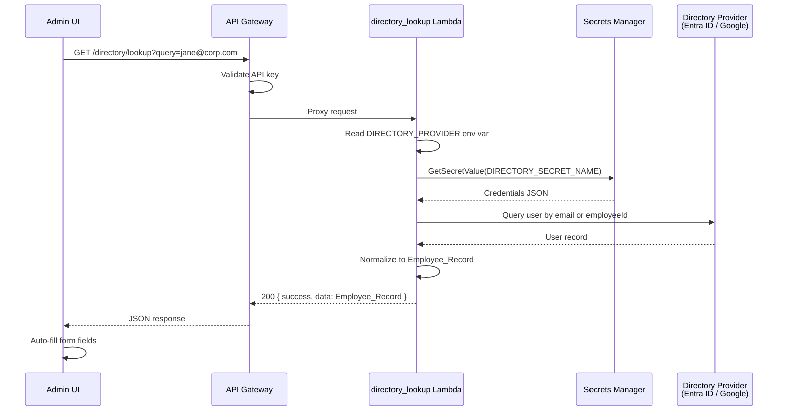
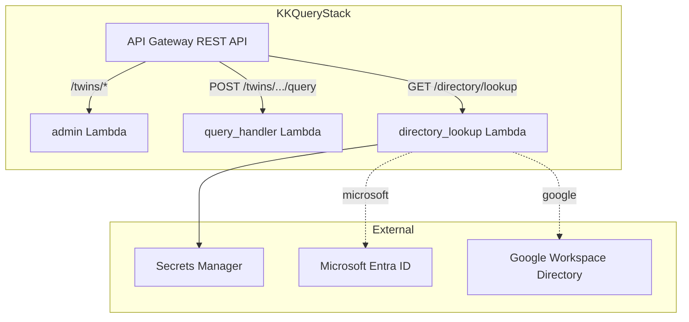

# Design Document: Directory Employee Lookup

## Overview

This feature adds a read-only directory lookup capability to KnowledgeKeeper that allows IT admins to search for employee information from Microsoft Entra ID (Graph API) or Google Workspace (Admin SDK Directory API) and auto-fill the offboarding form. The system introduces a new `GET /directory/lookup` API endpoint backed by a dedicated Lambda function (`directory_lookup`), and a lookup UI component in the AdminDashboard.

The Lambda reads the configured provider from environment variables, retrieves existing credentials from Secrets Manager (reusing the M365 and Google service account secrets already provisioned for the email fetcher integrations), queries the appropriate directory API, and returns a normalized `Employee_Record`. The frontend adds a search field above the offboarding form that calls this endpoint and populates form fields on success.

### Key Design Decisions

1. **Reuse existing credentials** — The M365 app registration (`M365_CREDS_SECRET`) and Google service account (`GOOGLE_CREDS_SECRET`) already have the necessary permissions. The directory lookup Lambda reads from the same Secrets Manager secrets, avoiding credential duplication.
2. **Dedicated Lambda with minimal IAM** — The `directory_lookup` Lambda only needs `secretsmanager:GetSecretValue` and CloudWatch Logs. It has no access to DynamoDB, S3, S3 Vectors, or Bedrock.
3. **Single provider per deployment** — The `DIRECTORY_PROVIDER` environment variable selects `microsoft` or `google`. Multi-provider lookup is out of scope.
4. **No caching** — Directory lookups are infrequent (offboarding events) and must return fresh data. No caching layer is introduced.
5. **10-second timeout** — The Lambda timeout is set to 10 seconds to match the requirement. External API calls use a matching request timeout.

## Architecture



### Infrastructure Layout



## Components and Interfaces

### 1. Lambda: `directory_lookup`

**Location**: `lambdas/query/directory_lookup/`

```
directory_lookup/
├── handler.py          # Thin handler: parse event, call logic, return response
├── logic.py            # Pure business logic: provider dispatch, API calls, normalization
├── requirements.txt    # msal, google-api-python-client, google-auth, requests
└── tests/
    └── test_logic.py   # Unit tests for logic.py
```

**handler.py** responsibilities:
- Parse `queryStringParameters.query` from the API Gateway event
- Instantiate Secrets Manager client via boto3
- Call `logic.lookup_employee(...)` with injected dependencies
- Return API Gateway proxy response in the standard envelope

**logic.py** public interface:

```python
class SecretsClient(Protocol):
    def get_secret_value(self, **kwargs: Any) -> dict: ...

def lookup_employee(
    query: str,
    provider: str,
    secret_name: str,
    secrets_client: SecretsClient,
) -> dict:
    """Look up an employee from the configured directory provider.
    
    Returns:
        {"success": True, "status_code": 200, "data": Employee_Record}
        or {"success": False, "status_code": int, "error": {...}}
    """
```

Internal functions:
- `_is_email(query: str) -> bool` — heuristic check (contains `@`)
- `_lookup_microsoft(query: str, secret_name: str, secrets_client) -> dict` — Entra ID via Graph API
- `_lookup_google(query: str, secret_name: str, secrets_client) -> dict` — Google Workspace via Admin SDK
- `_normalize_microsoft(graph_user: dict) -> EmployeeRecord` — field mapping
- `_normalize_google(directory_user: dict) -> EmployeeRecord` — field mapping

### 2. CDK Changes: `KKQueryStack`

Add to `infrastructure/stacks/query_stack.py`:

- **IAM Role** (`DirectoryLookupRole`): `secretsmanager:GetSecretValue` scoped to the directory secret ARN, plus `AWSLambdaBasicExecutionRole`. No DynamoDB, S3, S3 Vectors, or Bedrock permissions.
- **Lambda Function** (`DirectoryLookupFn`): Python 3.12, 10-second timeout, 256 MB memory, shared layer for `pydantic`. Environment variables: `DIRECTORY_PROVIDER`, `DIRECTORY_SECRET_NAME`.
- **API Gateway Resource**: `/directory/lookup` with `GET` method, API key required, Lambda proxy integration.

### 3. Frontend Changes

**`frontend/src/api/twins.ts`** — add:

```typescript
export interface EmployeeRecord {
  employeeId: string;
  name: string;
  email: string;
  role: string;
  department: string;
}

export async function lookupEmployee(query: string): Promise<EmployeeRecord> {
  const { data } = await apiClient.get<ApiResponse<EmployeeRecord>>(
    "/directory/lookup",
    { params: { query } }
  );
  if (!data.success) throw new Error(data.error?.message ?? "Lookup failed");
  return data.data;
}
```

**`frontend/src/pages/AdminDashboard.tsx`** — add:
- A lookup input + button above the offboarding form (inside the `showForm` block)
- State for `lookupQuery`, `lookupLoading`, `lookupError`
- On lookup success: populate `form.employeeId`, `form.name`, `form.email`, `form.role`, `form.department` — leave `offboardDate` and `provider` unchanged
- On lookup error: display inline alert with error message
- Loading state: disable button, show spinner text

## Data Models

### Employee_Record (API Response)

The normalized employee record returned by the lookup endpoint:

```json
{
  "employeeId": "abc-123",
  "name": "Jane Doe",
  "email": "jane@corp.com",
  "role": "Senior Engineer",
  "department": "Engineering"
}
```

All fields are strings. Missing fields from the directory provider are set to `""` (empty string).

### Microsoft Graph API Field Mapping

| Graph API Field | Employee_Record Field |
|---|---|
| `id` | `employeeId` |
| `displayName` | `name` |
| `mail` | `email` |
| `jobTitle` | `role` |
| `department` | `department` |

### Google Workspace Directory API Field Mapping

| Directory API Field | Employee_Record Field |
|---|---|
| `id` | `employeeId` |
| `name.fullName` | `name` |
| `primaryEmail` | `email` |
| `organizations[0].title` | `role` |
| `organizations[0].department` | `department` |

### Error Response Codes

| Scenario | HTTP Status | Error Code |
|---|---|---|
| Missing/empty query parameter | 400 | `VALIDATION_ERROR` |
| Employee not found in directory | 404 | `EMPLOYEE_NOT_FOUND` |
| Directory auth failure (401/403) | 502 | `DIRECTORY_AUTH_ERROR` |
| Directory rate limited (429) | 429 | `DIRECTORY_RATE_LIMITED` |
| Directory server error (5xx) | 502 | `DIRECTORY_UNAVAILABLE` |
| Secrets Manager failure | 500 | `CREDENTIALS_UNAVAILABLE` |
| Directory timeout (>10s) | 504 | `DIRECTORY_TIMEOUT` |
| Provider not configured | 500 | `PROVIDER_NOT_CONFIGURED` |

## Correctness Properties

*A property is a characteristic or behavior that should hold true across all valid executions of a system — essentially, a formal statement about what the system should do. Properties serve as the bridge between human-readable specifications and machine-verifiable correctness guarantees.*

### Property 1: Employee record completeness

*For any* valid directory provider response (Microsoft Graph or Google Directory), the normalized Employee_Record returned by `lookup_employee` SHALL contain exactly five string fields (`employeeId`, `name`, `email`, `role`, `department`), each of type `str`, and the result SHALL have `success=True` with `status_code=200`.

**Validates: Requirements 1.1, 1.4**

### Property 2: Empty and whitespace query rejection

*For any* query string that is empty or composed entirely of whitespace characters, `lookup_employee` SHALL return `success=False` with `status_code=400` and error code `VALIDATION_ERROR`, and SHALL NOT call the directory provider.

**Validates: Requirements 1.6**

### Property 3: Microsoft Graph API email-based dispatch

*For any* query string on the Microsoft provider, if the query contains an `@` character (email-shaped), the system SHALL call `GET /users/{email}` with `$select=id,displayName,mail,jobTitle,department`; otherwise it SHALL call `GET /users` with `$filter=employeeId eq '{query}'` and the same `$select`.

**Validates: Requirements 2.2, 2.3**

### Property 4: Microsoft field mapping with null handling

*For any* Microsoft Graph API user response object with arbitrary field values (including `None` and missing keys), `_normalize_microsoft` SHALL produce an Employee_Record where: `id` maps to `employeeId`, `displayName` maps to `name`, `mail` maps to `email`, `jobTitle` maps to `role`, `department` maps to `department` — and any field that is `None` or absent in the input SHALL be `""` in the output.

**Validates: Requirements 2.4, 2.5**

### Property 5: Google Directory API dispatch

*For any* query string on the Google provider, the system SHALL call the Admin SDK `users().get(userKey=query)` method with the query value as the `userKey`, regardless of whether the query is an email address or an employee ID.

**Validates: Requirements 3.2, 3.3**

### Property 6: Google field mapping with null handling

*For any* Google Directory API user response object with arbitrary field values (including `None`, missing keys, and empty `organizations` lists), `_normalize_google` SHALL produce an Employee_Record where: `id` maps to `employeeId`, `name.fullName` maps to `name`, `primaryEmail` maps to `email`, `organizations[0].title` maps to `role`, `organizations[0].department` maps to `department` — and any field that is `None`, absent, or unreachable (e.g. empty organizations array) SHALL be `""` in the output.

**Validates: Requirements 3.4, 3.5**

### Property 7: Directory HTTP error classification

*For any* HTTP error response from the directory provider, the Lambda SHALL map it to the correct status code and error code: HTTP 401 or 403 → (502, `DIRECTORY_AUTH_ERROR`); HTTP 429 → (429, `DIRECTORY_RATE_LIMITED`); HTTP 5xx → (502, `DIRECTORY_UNAVAILABLE`).

**Validates: Requirements 4.1, 4.2, 4.3**

### Property 8: Invalid provider rejection

*For any* `provider` string that is not `"microsoft"` or `"google"` (including empty string and `None`), `lookup_employee` SHALL return `success=False` with `status_code=500` and error code `PROVIDER_NOT_CONFIGURED`.

**Validates: Requirements 5.3**

### Property 9: Auto-fill field mapping preserves unrelated fields

*For any* Employee_Record returned by the lookup API and any pre-existing form state, the auto-fill operation SHALL set exactly the five fields (`employeeId`, `name`, `email`, `role`, `department`) to the values from the Employee_Record, and SHALL leave `offboardDate` and `provider` at their pre-existing values.

**Validates: Requirements 6.3, 6.4**

### Property 10: Error message display

*For any* error response from the lookup endpoint, the Admin UI SHALL display the error message string from the response in an inline alert visible to the user.

**Validates: Requirements 6.7**

## Error Handling

### Lambda Error Strategy

The `directory_lookup` Lambda follows the KnowledgeKeeper principle of "fail gracefully on query" — every error path returns a structured JSON response, never an unhandled 500.

| Error Source | Detection | Response |
|---|---|---|
| Missing/empty `query` param | Check before any external call | 400 `VALIDATION_ERROR` |
| Invalid `DIRECTORY_PROVIDER` | Check before Secrets Manager call | 500 `PROVIDER_NOT_CONFIGURED` |
| Secrets Manager failure | `try/except` around `get_secret_value` | 500 `CREDENTIALS_UNAVAILABLE` |
| Directory 401/403 | HTTP status check on response | 502 `DIRECTORY_AUTH_ERROR` |
| Directory 404 (user not found) | HTTP status check / API exception | 404 `EMPLOYEE_NOT_FOUND` |
| Directory 429 | HTTP status check on response | 429 `DIRECTORY_RATE_LIMITED` |
| Directory 5xx | HTTP status check on response | 502 `DIRECTORY_UNAVAILABLE` |
| Directory timeout (>10s) | `requests.Timeout` / `google.api_core` timeout | 504 `DIRECTORY_TIMEOUT` |
| Unexpected exception | Catch-all in handler | 500 `INTERNAL_ERROR` |

### Logging Policy

- Log the query type (email vs ID) and provider at INFO level
- Log error codes and HTTP status codes at WARNING level
- Never log the full Employee_Record, credential values, or secret contents
- Use structured logging with `employee_query_type` and `provider` fields

### Frontend Error Handling

- Network errors (no response): display "Unable to reach the server. Please try again."
- API errors (structured response): display the `error.message` from the response envelope
- `EMPLOYEE_NOT_FOUND`: display a specific message encouraging manual entry
- Loading state: disable the Lookup button and show "Looking up…" text to prevent duplicate requests

## Testing Strategy

### Unit Tests (logic.py)

**Framework**: `pytest` with `unittest.mock` for external API mocking

**Test file**: `lambdas/query/directory_lookup/tests/test_logic.py`

Tests target the pure business logic in `logic.py`. External dependencies (Secrets Manager, Graph API, Google Admin SDK) are injected via protocols and mocked in tests.

**Unit test cases**:
- Happy path: valid email query → Microsoft → returns Employee_Record
- Happy path: valid employee ID query → Microsoft → returns Employee_Record
- Happy path: valid email query → Google → returns Employee_Record
- Employee not found → 404 EMPLOYEE_NOT_FOUND
- Empty query → 400 VALIDATION_ERROR
- Whitespace-only query → 400 VALIDATION_ERROR
- Secrets Manager failure → 500 CREDENTIALS_UNAVAILABLE
- Directory auth error (401) → 502 DIRECTORY_AUTH_ERROR
- Directory rate limit (429) → 429 DIRECTORY_RATE_LIMITED
- Directory server error (500) → 502 DIRECTORY_UNAVAILABLE
- Directory timeout → 504 DIRECTORY_TIMEOUT
- Invalid provider → 500 PROVIDER_NOT_CONFIGURED
- Graph API response with null fields → empty strings in record
- Google response with empty organizations array → empty strings for role/department

### Property-Based Tests

**Framework**: `pytest` with `hypothesis` (Python property-based testing library)

**Configuration**: Minimum 100 examples per property test (`@settings(max_examples=100)`)

Each property test references its design document property via a tag comment:

```python
# Feature: directory-employee-lookup, Property 4: Microsoft field mapping with null handling
@given(st.fixed_dictionaries({
    "id": st.one_of(st.text(), st.none()),
    "displayName": st.one_of(st.text(), st.none()),
    "mail": st.one_of(st.text(), st.none()),
    "jobTitle": st.one_of(st.text(), st.none()),
    "department": st.one_of(st.text(), st.none()),
}))
def test_microsoft_field_mapping(graph_response):
    record = _normalize_microsoft(graph_response)
    assert isinstance(record["employeeId"], str)
    assert isinstance(record["name"], str)
    # ... all fields are strings, nulls become ""
```

**Property tests to implement**:

| Property | Generator Strategy |
|---|---|
| P1: Record completeness | Generate random valid Graph/Google responses, verify 5 string fields |
| P2: Empty/whitespace rejection | Generate whitespace-only strings (`st.text(alphabet=whitespace)`) |
| P3: Microsoft dispatch | Generate random strings, some with `@`, verify URL construction |
| P4: Microsoft field mapping | Generate dicts with optional None values for each Graph field |
| P5: Google dispatch | Generate random query strings, verify `userKey` parameter |
| P6: Google field mapping | Generate dicts with optional None values, optional empty `organizations` |
| P7: Error classification | Generate HTTP status codes in {401,403,429,500-599}, verify mapping |
| P8: Invalid provider | Generate strings excluding "microsoft" and "google" |
| P9: Auto-fill mapping | Generate random EmployeeRecord + random form state, verify field update |
| P10: Error display | Generate random error messages, verify they appear in UI alert |

### CDK Assertions

Infrastructure tests in `infrastructure/tests/` using `aws_cdk.assertions`:
- Verify `directory_lookup` Lambda exists with correct runtime, timeout, memory
- Verify IAM role has only `secretsmanager:GetSecretValue` and CloudWatch permissions
- Verify IAM role does NOT have DynamoDB, S3, S3 Vectors, or Bedrock permissions
- Verify API Gateway has `/directory/lookup` GET method with API key required

### Frontend Tests

Component tests for the lookup UI using React Testing Library:
- Lookup input and button render when form is shown
- Successful lookup populates form fields
- Error response displays inline alert
- Loading state disables button
