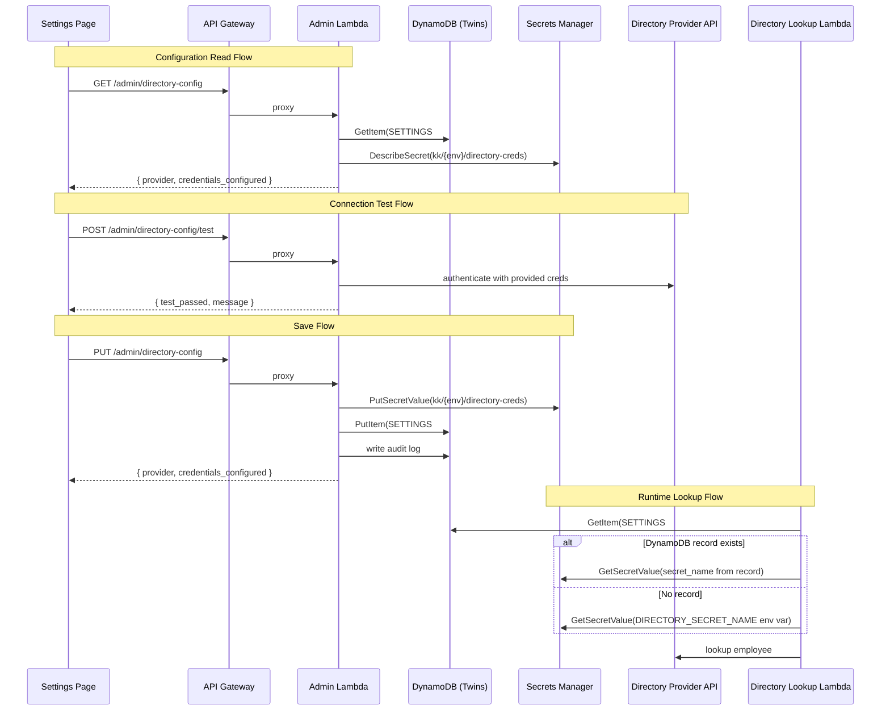

# Design Document: Directory Provider Setup

## Overview

This feature adds self-service directory provider configuration to KnowledgeKeeper, allowing IT admins to select a directory provider (Microsoft Entra ID or Google Workspace), enter credentials, test the connection, and save — all from the Admin Dashboard UI without CDK redeployments or AWS console access.

The design extends three existing layers:

1. **Admin Lambda** (`lambdas/query/admin/`) — new routes for GET/PUT/POST on `/admin/directory-config` and `/admin/directory-config/test`
2. **Directory Lookup Lambda** (`lambdas/query/directory_lookup/`) — updated to read provider config from DynamoDB at runtime, falling back to env vars
3. **Frontend** (`frontend/src/`) — new Settings page with provider selection, credential entry, connection test, and save workflow

Credentials are stored in AWS Secrets Manager (never env vars), and the active provider configuration is persisted as a DynamoDB settings record in the existing Twins table using a special partition key `SETTINGS#directory`.

## Architecture



### Design Decisions

1. **Settings record in Twins table** — Rather than creating a new DynamoDB table, we reuse the Twins table with a `SETTINGS#directory` partition key. This avoids CDK changes for a new table and keeps the settings co-located. The `SETTINGS#` prefix namespace prevents collisions with `employeeId` values.

2. **Credential existence check via DescribeSecret** — The GET endpoint uses `secretsmanager:DescribeSecret` to check if credentials exist without retrieving the secret value. This avoids unnecessary secret reads and follows least-privilege.

3. **Test-before-save pattern** — The connection test endpoint (`POST /admin/directory-config/test`) accepts credentials in the request body and tests them directly against the provider API without persisting. This lets admins verify before committing.

4. **DynamoDB-first with env var fallback** — The directory lookup Lambda checks DynamoDB first. If no settings record exists, it falls back to the existing `DIRECTORY_PROVIDER` and `DIRECTORY_SECRET_NAME` environment variables. This ensures backward compatibility with existing deployments.

## Components and Interfaces

### Backend — Admin Lambda Extensions

New functions added to `lambdas/query/admin/logic.py`:

```python
def get_directory_config(*, dynamo_module, secrets_module) -> dict:
    """GET /admin/directory-config — return current provider and credentials status."""

def save_directory_config(body, request_id, *, dynamo_module, secrets_module) -> dict:
    """PUT /admin/directory-config — validate, store creds in SM, save settings to DDB."""

def test_directory_connection(body) -> dict:
    """POST /admin/directory-config/test — authenticate against provider, return pass/fail."""
```

New routes added to `lambdas/query/admin/handler.py` dispatcher:

| Method | Resource | Handler |
|--------|----------|---------|
| `GET` | `/admin/directory-config` | `logic.get_directory_config` |
| `PUT` | `/admin/directory-config` | `logic.save_directory_config` |
| `POST` | `/admin/directory-config/test` | `logic.test_directory_connection` |

A new `_SecretsHelper` class in `handler.py` wraps `boto3.client("secretsmanager")` for dependency injection, following the existing `_S3Helper` and `_LambdaHelper` patterns.

### Backend — Directory Lookup Lambda Changes

`lambdas/query/directory_lookup/handler.py` is updated to:

1. Read `TWINS_TABLE_NAME` from env vars (new env var added via CDK)
2. Call `dynamo_module.get_item()` for `SETTINGS#directory` before each lookup
3. Use DynamoDB values if present, otherwise fall back to existing env vars

A new helper function is added to `lambdas/query/directory_lookup/logic.py`:

```python
def resolve_provider_config(
    dynamo_client,
    table_name: str,
    env_provider: str,
    env_secret_name: str,
) -> tuple[str, str]:
    """Return (provider, secret_name) from DynamoDB or env var fallback."""
```

### Backend — Credential Validation

Validation logic for each provider type:

**Microsoft Entra ID** — required fields: `tenant_id`, `client_id`, `client_secret`
**Google Workspace** — required fields: `service_account_key` (must be valid JSON); optional: `delegated_admin`

```python
def validate_credential_payload(provider: str, credentials: dict) -> list[str]:
    """Return list of missing/invalid field names. Empty list = valid."""
```

### Backend — Connection Test

The test function authenticates against the provider without performing a full lookup:

- **Microsoft**: Acquires an OAuth2 client credentials token from `login.microsoftonline.com`
- **Google**: Builds service account credentials and calls a lightweight directory API endpoint

Both paths have a 10-second timeout. The function returns `{ test_passed: bool, message: str }`.

### Infrastructure — CDK Changes (`infrastructure/stacks/query_stack.py`)

1. **Admin Lambda IAM** — add Secrets Manager permissions:
   - `secretsmanager:CreateSecret`, `secretsmanager:PutSecretValue`, `secretsmanager:GetSecretValue` scoped to `kk/{env}/directory-creds`
   - `secretsmanager:DescribeSecret` scoped to `kk/{env}/directory-creds`

2. **Directory Lookup Lambda** — add DynamoDB GetItem permission on Twins table and `TWINS_TABLE_NAME` env var

3. **API Gateway** — add `/admin/directory-config` resource with GET, PUT methods and `/admin/directory-config/test` resource with POST method, all wired to admin Lambda integration with API key required

### Frontend — New Settings Page

New file: `frontend/src/pages/SettingsPage.tsx`

- Provider selector (radio group): "Microsoft Entra ID" / "Google Workspace"
- Conditional credential fields based on selected provider
- "Test Connection" button → `POST /admin/directory-config/test`
- "Save" button → `PUT /admin/directory-config`
- Status display showing current provider and credential status
- Loading states and inline error/success feedback

### Frontend — API Functions

New functions in `frontend/src/api/twins.ts`:

```typescript
export interface DirectoryConfig {
  provider: "microsoft" | "google" | null;
  credentials_configured: boolean;
}

export interface DirectoryTestResult {
  test_passed: boolean;
  message?: string;
}

export async function getDirectoryConfig(): Promise<DirectoryConfig>;
export async function saveDirectoryConfig(payload: { provider: string; credentials: Record<string, string> }): Promise<DirectoryConfig>;
export async function testDirectoryConnection(payload: { provider: string; credentials: Record<string, string> }): Promise<DirectoryTestResult>;
```

### Frontend — Routing

`frontend/src/App.tsx` — add route: `<Route path="/settings" element={<SettingsPage />} />`

Navigation link added to `AdminDashboard.tsx` header.

## Data Models

### Directory Settings Record (DynamoDB)

Stored in the Twins table with a special partition key:

| Attribute | Type | Description |
|-----------|------|-------------|
| `employeeId` | String | `SETTINGS#directory` (partition key, reuses Twins table PK) |
| `provider` | String | `microsoft` or `google` |
| `secret_name` | String | Secrets Manager secret name, e.g. `kk/dev/directory-creds` |
| `updated_at` | String | ISO 8601 timestamp of last update |
| `updated_by` | String | Admin user ID who last saved the config |

### Secrets Manager Secret Structure

Secret name: `kk/{env}/directory-creds`

**Microsoft provider:**
```json
{
  "tenant_id": "...",
  "client_id": "...",
  "client_secret": "..."
}
```

**Google provider:**
```json
{
  "type": "service_account",
  "project_id": "...",
  "private_key_id": "...",
  "private_key": "...",
  "client_email": "...",
  "...": "...",
  "delegated_admin": "admin@example.com"
}
```

### API Request/Response Schemas

**GET /admin/directory-config — Response:**
```json
{
  "success": true,
  "data": {
    "provider": "microsoft",
    "credentials_configured": true
  },
  "error": null,
  "requestId": "..."
}
```

**PUT /admin/directory-config — Request:**
```json
{
  "provider": "microsoft",
  "credentials": {
    "tenant_id": "...",
    "client_id": "...",
    "client_secret": "..."
  }
}
```

**PUT /admin/directory-config — Response:**
```json
{
  "success": true,
  "data": {
    "provider": "microsoft",
    "credentials_configured": true
  },
  "error": null,
  "requestId": "..."
}
```

**POST /admin/directory-config/test — Request:**
```json
{
  "provider": "microsoft",
  "credentials": {
    "tenant_id": "...",
    "client_id": "...",
    "client_secret": "..."
  }
}
```

**POST /admin/directory-config/test — Response (success):**
```json
{
  "success": true,
  "data": {
    "test_passed": true,
    "message": "Connection successful"
  },
  "error": null,
  "requestId": "..."
}
```

**POST /admin/directory-config/test — Response (failure):**
```json
{
  "success": true,
  "data": {
    "test_passed": false,
    "message": "Authentication failed: invalid client_secret"
  },
  "error": null,
  "requestId": "..."
}
```

**Validation Error Response (400):**
```json
{
  "success": false,
  "data": null,
  "error": {
    "code": "VALIDATION_ERROR",
    "message": "Missing required fields: tenant_id, client_secret",
    "details": { "missing": ["tenant_id", "client_secret"] }
  },
  "requestId": "..."
}
```


## Correctness Properties

*A property is a characteristic or behavior that should hold true across all valid executions of a system — essentially, a formal statement about what the system should do. Properties serve as the bridge between human-readable specifications and machine-verifiable correctness guarantees.*

### Property 1: GET returns current configuration status

*For any* Directory_Settings_Record stored in DynamoDB (with any valid provider type) and any state of the Secrets Manager secret (existing or not), calling `get_directory_config` SHALL return the provider from the DynamoDB record and a `credentials_configured` boolean that matches whether the secret exists in Secrets Manager.

**Validates: Requirements 1.1**

### Property 2: No credential values in API responses

*For any* stored credential payload (Microsoft or Google) containing any combination of `tenant_id`, `client_id`, `client_secret`, or service account key fields, the response from `get_directory_config` SHALL NOT contain any of those credential values as substrings in the serialized response data.

**Validates: Requirements 1.2, 8.2**

### Property 3: Credential validation rejects invalid payloads

*For any* provider type in `{microsoft, google}` and *for any* credential payload where at least one required field is missing or empty (for Microsoft: `tenant_id`, `client_id`, `client_secret`; for Google: `service_account_key`), calling `validate_credential_payload` SHALL return a non-empty list of missing field names, and both `save_directory_config` and `test_directory_connection` SHALL return a 400 status with error code `VALIDATION_ERROR`.

**Validates: Requirements 2.2, 2.3, 2.4, 3.5**

### Property 4: Invalid provider type rejected

*For any* string that is not `microsoft` or `google`, calling `save_directory_config` or `test_directory_connection` with that string as the provider SHALL return a 400 status with error code `VALIDATION_ERROR`.

**Validates: Requirements 2.5**

### Property 5: Save round-trip

*For any* valid provider type and valid credential payload, after calling `save_directory_config`, calling `get_directory_config` SHALL return the saved provider type and `credentials_configured` set to `true`.

**Validates: Requirements 2.1, 2.6**

### Property 6: Save overwrites previous credentials

*For any* two distinct valid credential payloads (same or different provider), saving the first then saving the second, the Secrets Manager secret SHALL contain only the second payload's credential values.

**Validates: Requirements 2.7**

### Property 7: Audit log written on successful save

*For any* valid provider type and valid credential payload, after a successful `save_directory_config` call, the audit table SHALL contain an entry with action `save_directory_config` recording the provider type.

**Validates: Requirements 2.8**

### Property 8: Connection test does not persist

*For any* provider type and credential payload (valid or invalid), after calling `test_directory_connection`, the DynamoDB settings record and Secrets Manager secret SHALL remain unchanged from their state before the call.

**Validates: Requirements 3.4**

### Property 9: Config resolution — DynamoDB overrides env vars

*For any* DynamoDB settings record with provider `P_db` and secret name `S_db`, and *for any* environment variable values `P_env` and `S_env`, calling `resolve_provider_config` SHALL return `(P_db, S_db)`. When no DynamoDB record exists, it SHALL return `(P_env, S_env)`.

**Validates: Requirements 4.1, 4.2, 4.3**

## Error Handling

### Backend Error Handling

| Scenario | HTTP Status | Error Code | Behavior |
|----------|-------------|------------|----------|
| Missing/empty required credential fields | 400 | `VALIDATION_ERROR` | Return list of missing fields in `details.missing` |
| Invalid provider type | 400 | `VALIDATION_ERROR` | Return message listing valid providers |
| Google `service_account_key` is not valid JSON | 400 | `VALIDATION_ERROR` | Return message indicating invalid JSON |
| Secrets Manager API failure during save | 500 | `INTERNAL_ERROR` | Log error (no credentials), return generic message |
| DynamoDB write failure during save | 500 | `INTERNAL_ERROR` | Log error, return generic message |
| Connection test authentication failure | 200 | N/A | Return `{ test_passed: false, message: "..." }` |
| Connection test timeout (>10s) | 200 | N/A | Return `{ test_passed: false, message: "Connection timed out..." }` |
| No DynamoDB record AND no env vars for directory lookup | 500 | `PROVIDER_NOT_CONFIGURED` | Return structured error |
| Secrets Manager DescribeSecret fails on GET | 200 | N/A | Return `credentials_configured: false` (graceful degradation) |

### Frontend Error Handling

- API errors (non-2xx) display the `error.message` from the response envelope in an inline alert
- Network errors display a generic "Unable to reach server" message
- Loading states disable both "Test Connection" and "Save" buttons to prevent double-submission
- Credential fields are cleared after successful save (security)
- Failed saves preserve the form state so the admin can retry without re-entering

## Testing Strategy

### Unit Tests (pytest)

Unit tests target `logic.py` files following the existing project pattern. AWS SDK calls are mocked via dependency injection (the same pattern used in existing admin logic).

**Admin Lambda (`lambdas/query/admin/tests/test_logic.py`):**
- `test_get_directory_config_returns_provider_and_status` — happy path
- `test_get_directory_config_no_record_returns_null` — edge case (Req 1.3)
- `test_save_directory_config_stores_to_sm_and_ddb` — happy path
- `test_save_directory_config_invalid_provider_returns_400` — validation
- `test_save_directory_config_missing_microsoft_fields_returns_400` — validation
- `test_save_directory_config_missing_google_fields_returns_400` — validation
- `test_save_directory_config_invalid_json_google_key_returns_400` — validation
- `test_save_directory_config_writes_audit_log` — audit
- `test_test_directory_connection_success` — happy path with mocked provider
- `test_test_directory_connection_failure` — auth failure with mocked provider
- `test_test_directory_connection_timeout` — timeout scenario
- `test_test_directory_connection_does_not_persist` — no side effects

**Directory Lookup Lambda (`lambdas/query/directory_lookup/tests/test_logic.py`):**
- `test_resolve_provider_config_uses_dynamodb_when_record_exists` — DDB override
- `test_resolve_provider_config_falls_back_to_env_vars` — fallback
- `test_resolve_provider_config_no_config_raises_error` — edge case (Req 4.4)

**CDK Assertions (`infrastructure/tests/`):**
- Verify Admin Lambda IAM role has Secrets Manager permissions scoped to `kk/{env}/directory-creds`
- Verify Directory Lookup Lambda has DynamoDB GetItem on Twins table
- Verify API Gateway has `/admin/directory-config` routes with API key required

### Property-Based Tests (hypothesis for Python, fast-check for TypeScript)

Each property test runs a minimum of 100 iterations and references its design document property.

**Python (hypothesis) — `lambdas/query/admin/tests/test_logic.py`:**

- **Feature: directory-provider-setup, Property 3: Credential validation rejects invalid payloads** — Generate random provider types and credential dicts with at least one required field missing/empty. Assert `validate_credential_payload` returns the missing fields.
- **Feature: directory-provider-setup, Property 4: Invalid provider type rejected** — Generate random strings excluding "microsoft" and "google". Assert validation returns error.
- **Feature: directory-provider-setup, Property 5: Save round-trip** — Generate random valid provider + credentials. Save, then GET. Assert provider matches and credentials_configured is true.
- **Feature: directory-provider-setup, Property 7: Audit log written on successful save** — Generate random valid saves. Assert audit table contains matching entry.
- **Feature: directory-provider-setup, Property 8: Connection test does not persist** — Generate random payloads. Snapshot DDB/SM state, call test endpoint, assert state unchanged.
- **Feature: directory-provider-setup, Property 9: Config resolution — DynamoDB overrides env vars** — Generate random DDB records and env var values. Assert `resolve_provider_config` returns DDB values when present, env vars otherwise.

**TypeScript (fast-check) — `frontend/src/utils/__tests__/`:**

- **Feature: directory-provider-setup, Property 3: Credential validation rejects invalid payloads** — If a client-side validation function is implemented, generate random credential objects with missing fields and verify rejection. (Only if client-side validation is added.)

### Testing Libraries

- **Backend**: `pytest` + `hypothesis` for property-based tests, `unittest.mock` for dependency injection mocks
- **Frontend**: `vitest` + `fast-check` for property-based tests, `@testing-library/react` for component tests
- **Infrastructure**: `aws_cdk.assertions` for CDK template assertions
