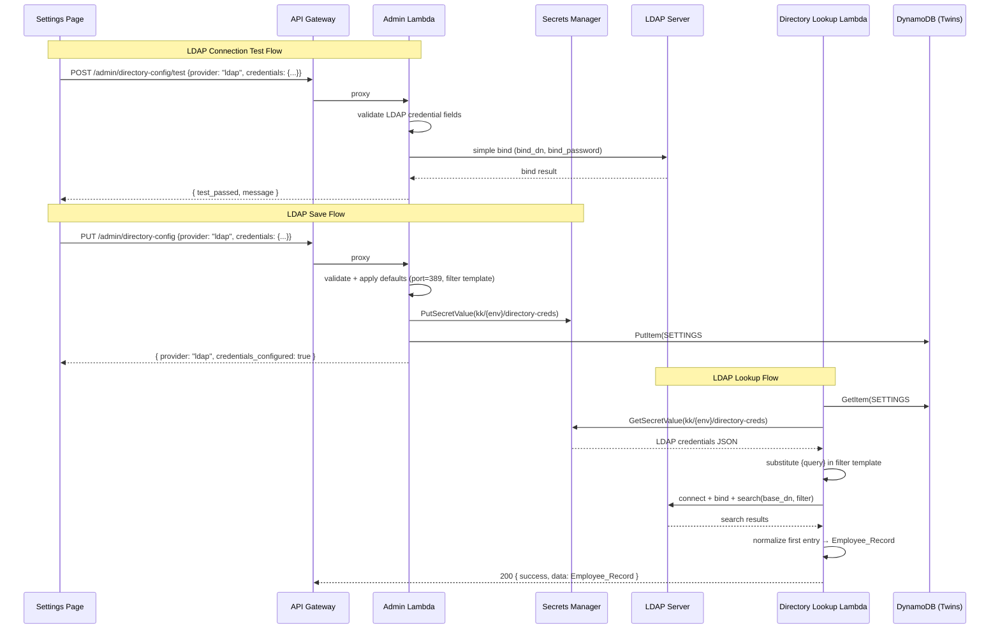

# Design Document: LDAP Directory Lookup

## Overview

This feature adds LDAP as a third directory provider to KnowledgeKeeper, alongside the existing Microsoft Entra ID and Google Workspace providers. IT admins can configure LDAP connection details (server URL, port, bind DN, bind password, search base DN, search filter template) through the Settings page, test connectivity via LDAP bind, and perform read-only employee lookups that return the same normalized Employee_Record used by the existing providers.

The design extends four existing layers:

1. **Directory Lookup Lambda** (`lambdas/query/directory_lookup/`) — new `_lookup_ldap()` function using the `ldap3` library for LDAP search and attribute mapping
2. **Admin Lambda** (`lambdas/query/admin/`) — extended credential validation, connection test, and provider acceptance to handle `ldap` as a valid provider type
3. **Frontend** (`frontend/src/pages/SettingsPage.tsx`) — LDAP added as a third provider option with LDAP-specific credential fields, defaults for port (389) and search filter template
4. **Infrastructure** — `ldap3` added to `requirements.txt` for both Lambdas; no new IAM permissions or CDK changes required

### Key Design Decisions

1. **Reuse existing credential storage** — LDAP credentials are stored in the same Secrets Manager secret (`kk/{env}/directory-creds`) used by Microsoft and Google providers. The `save_directory_config` flow already handles overwriting credentials when the provider changes.
2. **`ldap3` library** — Pure-Python LDAP v3 client with no C dependencies, making it ideal for Lambda packaging. Supports simple bind, search, and connection timeouts natively.
3. **Configurable search filter with defaults** — The search filter template defaults to `(|(mail={query})(uid={query}))` and port defaults to `389`, reducing configuration burden for common LDAP setups while allowing customization for non-standard schemas.
4. **No additional IAM permissions** — LDAP connections are outbound TCP from the Lambda. The existing Secrets Manager and DynamoDB permissions are sufficient. No VPC configuration is needed for cloud-hosted LDAP servers (for on-premises LDAP behind a firewall, VPC configuration would be a separate concern outside this feature's scope).
5. **10-second timeout** — Consistent with the existing Microsoft and Google provider timeouts. The `ldap3` library's `receive_timeout` parameter enforces this at the connection level.

## Architecture



## Components and Interfaces

### 1. Directory Lookup Lambda — LDAP Provider (`lambdas/query/directory_lookup/logic.py`)

New function added alongside existing `_lookup_microsoft` and `_lookup_google`:

```python
def _lookup_ldap(
    query: str,
    secret_name: str,
    secrets_client: SecretsClient,
) -> dict:
    """Look up an employee via LDAP search.
    
    Retrieves LDAP connection params from Secrets Manager, connects with
    simple bind, searches using the configured filter template with {query}
    substituted, and normalizes the first matching entry to Employee_Record.
    """
```

Internal helper for LDAP attribute mapping:

```python
def _normalize_ldap(entry_attributes: dict) -> dict:
    """Map LDAP attributes to Employee_Record.
    
    Mapping: uid → employeeId, cn → name, mail → email,
    title → role, departmentNumber → department.
    Missing/empty attributes → empty string.
    """
```

The existing `lookup_employee` function's provider dispatch is extended to accept `"ldap"` and route to `_lookup_ldap`.

### 2. Admin Lambda — LDAP Validation and Connection Test (`lambdas/query/admin/logic.py`)

Extensions to existing functions:

**`validate_credential_payload`** — extended to handle `provider == "ldap"`:
- Required fields: `server_url`, `bind_dn`, `bind_password`, `search_base_dn`
- Optional fields with defaults: `port` (default `"389"`), `search_filter_template` (default `"(|(mail={query})(uid={query}))"`)
- Returns list of missing required field names

**`VALID_DIRECTORY_PROVIDERS`** — updated from `{"microsoft", "google"}` to `{"microsoft", "google", "ldap"}`

**`save_directory_config`** — before storing LDAP credentials, applies defaults for `port` and `search_filter_template` if missing/empty, so the stored credential payload always contains all six fields.

**`test_directory_connection`** — new `_test_ldap_connection` function:
```python
def _test_ldap_connection(credentials: dict) -> dict:
    """Connect to LDAP server and perform simple bind.
    
    Returns {test_passed: bool, message: str}. 10-second timeout.
    Never persists credentials.
    """
```

### 3. Frontend — Settings Page LDAP UI (`frontend/src/pages/SettingsPage.tsx`)

Extensions to the existing Settings page:

- Third radio option in provider selector: "LDAP"
- When LDAP is selected, display fields: Server URL, Port (default "389"), Bind DN, Bind Password (masked), Search Base DN, Search Filter Template (default `(|(mail={query})(uid={query}))`)
- Helper text below Search Filter Template: "Use `{query}` as a placeholder — it will be replaced with the lookup value at runtime."
- Clear all LDAP fields after successful save

**`DirectoryConfig` type** — updated to include `"ldap"` in the provider union:
```typescript
export interface DirectoryConfig {
  provider: "microsoft" | "google" | "ldap" | null;
  credentials_configured: boolean;
}
```

### 4. Dependencies

- `lambdas/query/directory_lookup/requirements.txt` — add `ldap3`
- `lambdas/query/admin/requirements.txt` (create if not exists) — add `ldap3`

No CDK infrastructure changes are required. The existing IAM permissions, API Gateway routes, and environment variables are sufficient.

## Data Models

### LDAP Credential Payload (Secrets Manager)

When provider is `ldap`, the Secrets Manager secret `kk/{env}/directory-creds` contains:

```json
{
  "server_url": "ldap://ldap.example.com",
  "port": "389",
  "bind_dn": "cn=read-only-admin,dc=example,dc=com",
  "bind_password": "...",
  "search_base_dn": "dc=example,dc=com",
  "search_filter_template": "(|(mail={query})(uid={query}))"
}
```

All values are strings. The `port` and `search_filter_template` fields always have values (defaults applied during save).

### LDAP Attribute → Employee_Record Mapping

| LDAP Attribute | Employee_Record Field |
|---|---|
| `uid` | `employeeId` |
| `cn` | `name` |
| `mail` | `email` |
| `title` | `role` |
| `departmentNumber` | `department` |

Missing or empty LDAP attributes map to `""` (empty string), consistent with the Microsoft and Google normalization behavior.

### API Request/Response Examples

**PUT /admin/directory-config — LDAP Request:**
```json
{
  "provider": "ldap",
  "credentials": {
    "server_url": "ldap://ldap.example.com",
    "port": "389",
    "bind_dn": "cn=admin,dc=example,dc=com",
    "bind_password": "...",
    "search_base_dn": "ou=people,dc=example,dc=com",
    "search_filter_template": "(|(mail={query})(uid={query}))"
  }
}
```

**POST /admin/directory-config/test — LDAP Request:**
```json
{
  "provider": "ldap",
  "credentials": {
    "server_url": "ldap://ldap.example.com",
    "port": "389",
    "bind_dn": "cn=admin,dc=example,dc=com",
    "bind_password": "...",
    "search_base_dn": "ou=people,dc=example,dc=com"
  }
}
```

**GET /directory/lookup?query=jane@example.com — LDAP Response:**
```json
{
  "success": true,
  "data": {
    "employeeId": "jdoe",
    "name": "Jane Doe",
    "email": "jane@example.com",
    "role": "Senior Engineer",
    "department": "Engineering"
  },
  "error": null,
  "requestId": "..."
}
```


## Correctness Properties

*A property is a characteristic or behavior that should hold true across all valid executions of a system — essentially, a formal statement about what the system should do. Properties serve as the bridge between human-readable specifications and machine-verifiable correctness guarantees.*

### Property 1: LDAP field mapping with null handling

*For any* LDAP entry attribute dictionary with arbitrary values (including `None`, missing keys, and empty strings) for the fields `uid`, `cn`, `mail`, `title`, and `departmentNumber`, `_normalize_ldap` SHALL produce an Employee_Record where: `uid` maps to `employeeId`, `cn` maps to `name`, `mail` maps to `email`, `title` maps to `role`, `departmentNumber` maps to `department` — and any field that is `None`, absent, or empty in the input SHALL be `""` in the output. All five output fields SHALL be of type `str`.

**Validates: Requirements 1.4, 1.5**

### Property 2: LDAP credential validation rejects invalid payloads

*For any* credential payload where the provider is `ldap` and at least one of the required fields (`server_url`, `bind_dn`, `bind_password`, `search_base_dn`) is missing or empty (whitespace-only counts as empty), calling `validate_credential_payload` SHALL return a non-empty list containing the names of the missing fields.

**Validates: Requirements 3.1, 3.4**

### Property 3: LDAP defaults application on save

*For any* valid LDAP credential payload where `port` is missing or empty and/or `search_filter_template` is missing or empty, after calling `save_directory_config`, the credential payload stored in Secrets Manager SHALL contain `port` set to `"389"` and `search_filter_template` set to `"(|(mail={query})(uid={query}))"`. Fields that were provided with non-empty values SHALL be preserved unchanged.

**Validates: Requirements 3.2, 3.3, 3.5**

### Property 4: Filter template substitution

*For any* search filter template string containing `{query}` and *for any* non-empty query string, the LDAP search filter used at runtime SHALL be the template with all occurrences of `{query}` replaced by the query value, and the resulting filter SHALL not contain the literal string `{query}`.

**Validates: Requirements 1.3**

### Property 5: Invalid filter template rejection

*For any* LDAP credential payload where the `search_filter_template` field does not contain the substring `{query}`, calling `_lookup_ldap` SHALL return `success=False` with `status_code=500` and error code `PROVIDER_NOT_CONFIGURED`.

**Validates: Requirements 2.4**

### Property 6: LDAP error classification

*For any* LDAP operation error, the Directory_Lookup_Lambda SHALL classify it as follows: bind credential failures (invalid credentials exception from ldap3) → (502, `DIRECTORY_AUTH_ERROR`); connection refused or server unreachable (socket/connection exceptions) → (502, `DIRECTORY_UNAVAILABLE`); operation timeout → (504, `DIRECTORY_TIMEOUT`).

**Validates: Requirements 2.1, 2.2, 1.8**

### Property 7: No LDAP credential values in API responses

*For any* stored LDAP credential payload containing any combination of `server_url`, `bind_dn`, `bind_password`, `search_base_dn`, `port`, and `search_filter_template` values, the response from `get_directory_config` SHALL NOT contain any of those credential values as substrings in the serialized response data. The response SHALL contain only `provider` and `credentials_configured` fields.

**Validates: Requirements 8.2**

### Property 8: LDAP connection test does not persist

*For any* LDAP credential payload (valid or invalid), after calling `test_directory_connection` with provider `ldap`, the DynamoDB settings record and Secrets Manager secret SHALL remain unchanged from their state before the call.

**Validates: Requirements 4.4**

## Error Handling

### Directory Lookup Lambda — LDAP Errors

| Error Source | Detection | Response |
|---|---|---|
| Secrets Manager failure | `try/except` around `get_secret_value` | 500 `CREDENTIALS_UNAVAILABLE` |
| Filter template missing `{query}` | String check before search | 500 `PROVIDER_NOT_CONFIGURED` |
| LDAP bind failure (invalid credentials) | `ldap3.core.exceptions.LDAPBindError` | 502 `DIRECTORY_AUTH_ERROR` |
| LDAP server unreachable | `ldap3.core.exceptions.LDAPSocketOpenError`, `LDAPSocketReceiveError` | 502 `DIRECTORY_UNAVAILABLE` |
| LDAP operation timeout | `ldap3.core.exceptions.LDAPSocketReceiveError` with timeout, or `receive_timeout` exceeded | 504 `DIRECTORY_TIMEOUT` |
| LDAP search returns zero entries | Empty search result list | 404 `EMPLOYEE_NOT_FOUND` |
| Unexpected LDAP exception | Catch-all in handler | 500 `INTERNAL_ERROR` |

### Admin Lambda — LDAP Connection Test Errors

| Error Source | Detection | Response |
|---|---|---|
| Missing required LDAP fields | `validate_credential_payload` returns non-empty list | 400 `VALIDATION_ERROR` |
| LDAP bind failure | `ldap3.core.exceptions.LDAPBindError` | `{ test_passed: false, message: "LDAP bind failed: ..." }` |
| LDAP server unreachable | `LDAPSocketOpenError` | `{ test_passed: false, message: "LDAP server unreachable: ..." }` |
| Connection timeout (>10s) | `receive_timeout` exceeded | `{ test_passed: false, message: "Connection timed out after 10 seconds" }` |

### Logging Policy

- Log the provider type (`ldap`) and query type (email vs ID) at INFO level
- Log LDAP error types and messages at WARNING level
- Never log `bind_password`, `bind_dn`, `server_url`, or any credential values
- Never log the full Employee_Record

## Testing Strategy

### Unit Tests (pytest)

Unit tests target `logic.py` files following the existing project pattern. LDAP operations are mocked via `unittest.mock`.

**Directory Lookup Lambda (`lambdas/query/directory_lookup/tests/test_logic.py`):**
- `test_lookup_ldap_happy_path_email_query` — valid email query returns Employee_Record
- `test_lookup_ldap_happy_path_id_query` — valid employee ID query returns Employee_Record
- `test_lookup_ldap_no_results_returns_404` — empty search result → EMPLOYEE_NOT_FOUND
- `test_lookup_ldap_bind_failure_returns_502` — invalid credentials → DIRECTORY_AUTH_ERROR
- `test_lookup_ldap_server_unreachable_returns_502` — connection refused → DIRECTORY_UNAVAILABLE
- `test_lookup_ldap_timeout_returns_504` — timeout → DIRECTORY_TIMEOUT
- `test_lookup_ldap_credentials_unavailable` — Secrets Manager failure → CREDENTIALS_UNAVAILABLE
- `test_lookup_ldap_invalid_filter_template` — filter without `{query}` → PROVIDER_NOT_CONFIGURED
- `test_lookup_ldap_missing_attributes_returns_empty_strings` — partial LDAP entry → empty strings

**Admin Lambda (`lambdas/query/admin/tests/test_logic.py`):**
- `test_validate_ldap_credentials_valid` — all required fields present → empty list
- `test_validate_ldap_credentials_missing_fields` — missing required fields → list of missing
- `test_validate_ldap_credentials_defaults_applied` — missing port/filter → defaults applied
- `test_save_ldap_config_stores_with_defaults` — save with missing optional fields → defaults in SM
- `test_test_ldap_connection_success` — successful bind → test_passed true
- `test_test_ldap_connection_bind_failure` — bind failure → test_passed false
- `test_test_ldap_connection_timeout` — timeout → test_passed false with timeout message

### Property-Based Tests

**Framework**: `pytest` + `hypothesis` (Python), `vitest` + `fast-check` (TypeScript)

**Configuration**: Minimum 100 examples per property test (`@settings(max_examples=100)`)

Each property test references its design document property via a tag comment.

**Python (hypothesis) — `lambdas/query/directory_lookup/tests/test_ldap_property.py`:**

- **Feature: ldap-directory-lookup, Property 1: LDAP field mapping with null handling** — Generate dicts with optional None/missing values for `uid`, `cn`, `mail`, `title`, `departmentNumber`. Assert all five output fields are strings, nulls become `""`, present values are preserved.

- **Feature: ldap-directory-lookup, Property 4: Filter template substitution** — Generate random filter templates containing `{query}` and random non-empty query strings. Assert the resulting filter has `{query}` replaced and does not contain the literal `{query}`.

- **Feature: ldap-directory-lookup, Property 5: Invalid filter template rejection** — Generate random strings that do not contain `{query}`. Assert `_lookup_ldap` returns error with `PROVIDER_NOT_CONFIGURED`.

- **Feature: ldap-directory-lookup, Property 6: LDAP error classification** — Generate LDAP exception types (LDAPBindError, LDAPSocketOpenError, timeout). Assert correct error code mapping.

**Python (hypothesis) — `lambdas/query/admin/tests/test_ldap_validation_property.py`:**

- **Feature: ldap-directory-lookup, Property 2: LDAP credential validation rejects invalid payloads** — Generate random credential dicts with at least one required LDAP field missing/empty. Assert `validate_credential_payload("ldap", creds)` returns the missing fields.

- **Feature: ldap-directory-lookup, Property 3: LDAP defaults application on save** — Generate valid LDAP credential payloads with missing/empty `port` and/or `search_filter_template`. Mock SM and DDB. Call `save_directory_config`. Assert the payload stored in SM contains default values for missing fields.

**TypeScript (fast-check) — `frontend/src/api/__tests__/ldapDirectoryConfigNoCredentials.property.test.ts`:**

- **Feature: ldap-directory-lookup, Property 7: No LDAP credential values in API responses** — Generate random LDAP credential values. Build a `DirectoryConfig` response with provider `"ldap"`. Assert the serialized response contains none of the credential values or credential field names.

### Testing Libraries

- **Backend**: `pytest` + `hypothesis` for property-based tests, `unittest.mock` for dependency injection mocks
- **Frontend**: `vitest` + `fast-check` for property-based tests
- **Property test minimum**: 100 iterations per property
- **Tag format**: `Feature: ldap-directory-lookup, Property {N}: {title}`
