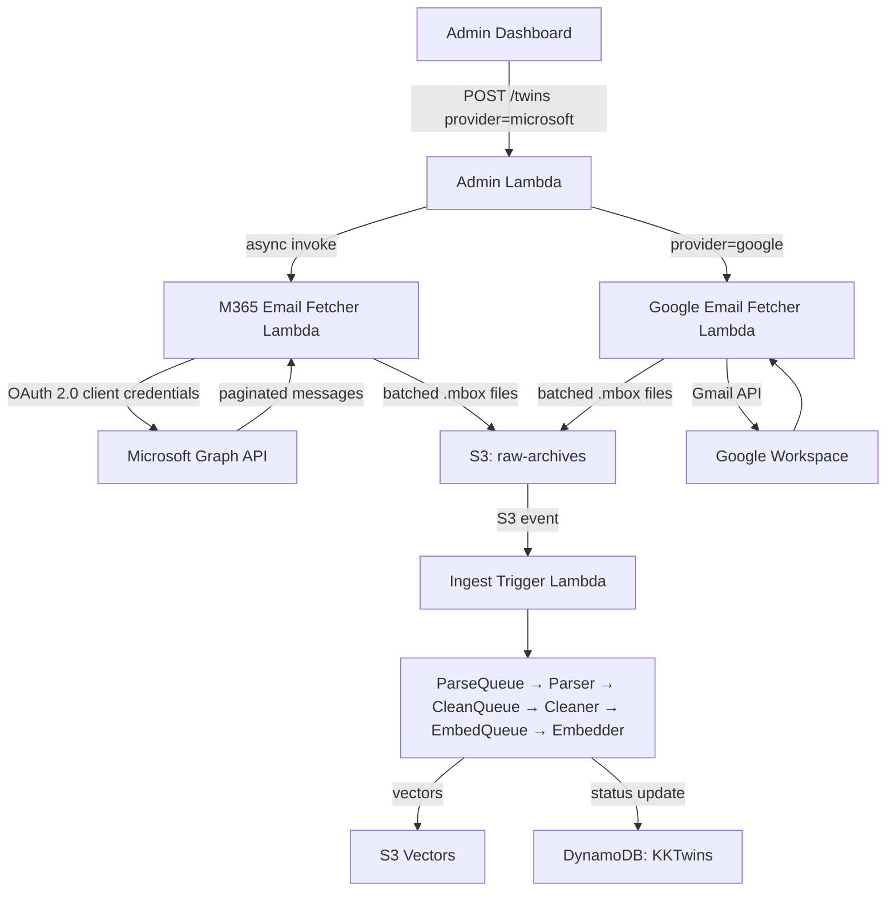
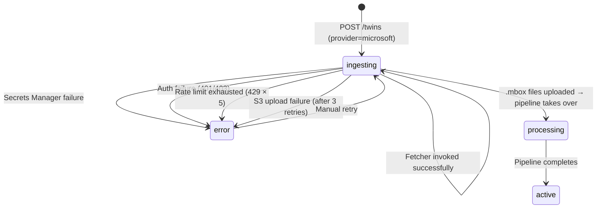

# Design Document — M365 Email Integration

## Overview

This feature extends KnowledgeKeeper's ingestion layer to support Microsoft 365 email retrieval alongside the existing Google Workspace and file-upload providers. A new `m365_email_fetcher` Lambda function authenticates to the Microsoft Graph API using OAuth 2.0 client credentials, enumerates mailbox folders, fetches messages with pagination and rate-limit handling, converts them to RFC 2822 / .mbox format, and uploads batched files to the existing raw-archives S3 bucket. The downstream ingestion pipeline (trigger → parser → cleaner → embedder) is provider-agnostic and requires no changes.

The design mirrors the existing `email_fetcher` (Google Workspace) in structure: a thin `handler.py` for AWS event parsing and a pure `logic.py` for testable business logic. Supporting changes span the Twin data model (`provider` field), admin Lambda dispatch, CDK infrastructure, and the frontend provider dropdown.

---

## Architecture

The M365 email fetcher slots into the existing ingestion layer as a parallel path to the Google Workspace fetcher. Both fetchers produce identical output (.mbox files in S3), so the downstream pipeline is unaffected.



### Key Design Decisions

1. **Separate Lambda, not a shared fetcher**: The M365 fetcher is a distinct Lambda (`m365_email_fetcher`) rather than adding Graph API logic to the existing `email_fetcher`. This keeps each provider's dependencies isolated (MSAL vs google-auth), simplifies IAM scoping, and allows independent deployment/rollback.

2. **MSAL for authentication**: The `msal` Python library handles OAuth 2.0 client credentials flow, token caching, and automatic refresh. This avoids hand-rolling token management and handles edge cases like token expiry mid-fetch.

3. **Same S3 key pattern**: Output files use the identical `{employeeId}/batch_{batchNumber:04d}.mbox` pattern as the Google fetcher, so the ingest_trigger Lambda fires the same pipeline without modification.

4. **Graph API message-to-RFC 2822 conversion in logic.py**: Since Graph API returns JSON (not raw RFC 2822), the fetcher must construct RFC 2822 messages from the JSON fields. This conversion is a pure function in `logic.py` for testability.

5. **Folder enumeration with exclusions**: The fetcher enumerates all mail folders via `GET /users/{email}/mailFolders` and skips "Deleted Items" and "Junk Email" by display name, matching the Google fetcher's exclusion of TRASH and SPAM labels.

---

## Components and Interfaces

### 1. M365 Email Fetcher Lambda (`lambdas/ingestion/m365_email_fetcher/`)

**Structure** (follows existing Lambda conventions):
```
m365_email_fetcher/
├── __init__.py
├── handler.py          # Thin Lambda handler — event parsing, AWS client setup
├── logic.py            # Pure business logic — Graph API calls, conversion, upload
├── requirements.txt    # msal, requests, boto3
└── tests/
    ├── __init__.py
    └── test_logic.py
```

**handler.py** — Thin entry point (mirrors existing `email_fetcher/handler.py`):
```python
def handler(event, context):
    """Expected event: {"employeeId": "emp_123", "email": "jane@corp.com"}"""
    employee_id = event["employeeId"]
    user_email = event["email"]

    # Set Twin status to 'ingesting'
    twins_table.update_item(Key={"employeeId": employee_id}, ...)

    try:
        credentials = get_m365_credentials(
            secret_name=M365_CREDS_SECRET, secrets_client=secrets_client
        )
        manifest = fetch_and_upload_emails(
            employee_id=employee_id,
            user_email=user_email,
            bucket_name=RAW_ARCHIVES_BUCKET,
            credentials=credentials,
            s3_client=s3_client,
        )
        return {"statusCode": 200, "employeeId": employee_id, ...}
    except Exception:
        # Update Twin status to 'error', re-raise
        twins_table.update_item(Key={"employeeId": employee_id}, ...)
        raise
```

**logic.py** — Core functions:

| Function | Purpose |
|---|---|
| `get_m365_credentials(secret_name, secrets_client)` | Retrieve tenant_id, client_id, client_secret from Secrets Manager; return an MSAL `ConfidentialClientApplication` |
| `acquire_token(app)` | Acquire OAuth 2.0 access token via client credentials flow; handles refresh |
| `list_mail_folders(token, user_email)` | `GET /users/{email}/mailFolders` — returns folder list excluding "Deleted Items" and "Junk Email" |
| `fetch_folder_messages(token, user_email, folder_id)` | Paginated `GET /users/{email}/mailFolders/{folderId}/messages` with `$select` for required fields |
| `graph_message_to_rfc2822(msg_json)` | Convert a single Graph API message JSON to RFC 2822 `bytes` |
| `messages_to_mbox(rfc2822_messages)` | Package a list of RFC 2822 byte strings into a single .mbox file |
| `fetch_and_upload_emails(employee_id, user_email, bucket_name, credentials, s3_client)` | Orchestrator: enumerate folders → fetch messages → batch → convert → upload .mbox → write manifest |

### 2. Admin Lambda Changes (`lambdas/query/admin/`)

**logic.py** — `create_twin()` modifications:
- Accept `"microsoft"` as a valid `provider` value
- Add provider validation: reject unknown providers with `VALIDATION_ERROR`
- Dispatch to M365 fetcher when `provider == "microsoft"` (using `M365_EMAIL_FETCHER_FN_NAME` env var)

**handler.py** — No structural changes; the `_LambdaHelper.invoke_async()` already supports invoking any Lambda by name.

### 3. Shared Models (`lambdas/shared/models.py`)

- Extend `Twin.provider` Literal type: `"google" | "upload"` → `"google" | "upload" | "microsoft"`

### 4. Frontend (`frontend/src/`)

- `api/twins.ts`: Add `"microsoft"` to `CreateTwinPayload.provider` union type
- `pages/AdminDashboard.tsx`: Add `<option value="microsoft">Microsoft 365</option>` to provider dropdown, ordered: Google Workspace, Microsoft 365, File Upload (.mbox)

### 5. CDK Infrastructure (`infrastructure/stacks/ingestion_stack.py`)

- New Lambda function: `kk-{env}-ingestion-m365-email-fetcher`
- Dedicated IAM role with least-privilege permissions
- New environment variable on admin Lambda: `M365_EMAIL_FETCHER_FN_NAME`
- `lambda:InvokeFunction` permission on admin role for the M365 fetcher ARN
- Stack output: `M365EmailFetcherFnArn`

---

## Data Models

### Graph API Message JSON → RFC 2822 Field Mapping

| Graph API Field | RFC 2822 Header | Notes |
|---|---|---|
| `internetMessageId` | `Message-ID` | Direct mapping |
| `conversationId` | `Thread-ID` | Custom header for thread reconstruction |
| `from.emailAddress` | `From` | Format: `"name" <email>` |
| `toRecipients[].emailAddress` | `To` | Comma-separated |
| `ccRecipients[].emailAddress` | `Cc` | Comma-separated |
| `receivedDateTime` | `Date` | ISO 8601 → RFC 2822 date format |
| `subject` | `Subject` | Direct mapping |
| `body.content` | Body | MIME multipart if HTML (text/html + text/plain) |
| `body.contentType` | `Content-Type` | `"html"` → multipart/alternative; `"text"` → text/plain |

### Secrets Manager Schema

**Path**: `kk/{env}/m365-credentials`

```json
{
  "tenant_id": "xxxxxxxx-xxxx-xxxx-xxxx-xxxxxxxxxxxx",
  "client_id": "xxxxxxxx-xxxx-xxxx-xxxx-xxxxxxxxxxxx",
  "client_secret": "~xxxxxxxxxxxxxxxxxxxxxxxxxxxxxxxxxx"
}
```

### Manifest JSON Schema (unchanged from Google fetcher)

**Path**: `{employeeId}/manifest.json`

```json
{
  "employeeId": "emp_123",
  "totalCount": 4821,
  "batchCount": 49,
  "dateRange": {
    "earliest": "2021-03-15T10:00:00+00:00",
    "latest": "2024-11-01T16:30:00+00:00"
  },
  "folderBreakdown": {
    "Inbox": 3200,
    "Sent Items": 1500,
    "Drafts": 121
  },
  "fetchTimestamp": "2024-12-01T12:00:00+00:00"
}
```

### Twin Model Update

```python
# lambdas/shared/models.py — Twin class
provider: Literal["google", "upload", "microsoft"] = "upload"
```

### Frontend Type Update

```typescript
// frontend/src/api/twins.ts — CreateTwinPayload
provider: "google" | "upload" | "microsoft";
```

### Graph API Endpoints Used

| Endpoint | Purpose | Pagination |
|---|---|---|
| `GET /users/{email}/mailFolders` | Enumerate all mail folders | `@odata.nextLink` |
| `GET /users/{email}/mailFolders/{folderId}/messages` | Fetch messages from a folder | `$top=100` + `@odata.nextLink` |

**Required `$select` fields**: `id,internetMessageId,subject,from,toRecipients,ccRecipients,bccRecipients,body,receivedDateTime,internetMessageHeaders,conversationId`

### Rate Limiting Strategy

The Microsoft Graph API returns HTTP 429 with a `Retry-After` header. The fetcher implements:
- Wait for `Retry-After` seconds before retrying
- Maximum 5 retries per request
- Exponential backoff as fallback if `Retry-After` header is missing

### S3 Upload Retry Strategy

- Up to 3 retries with exponential backoff (1s, 2s, 4s) for failed batch uploads
- After 3 failures, update Twin status to `error` and terminate

---

## Correctness Properties

*A property is a characteristic or behavior that should hold true across all valid executions of a system — essentially, a formal statement about what the system should do. Properties serve as the bridge between human-readable specifications and machine-verifiable correctness guarantees.*

### Property 1: Valid provider acceptance

*For any* valid twin creation payload where the `provider` field is one of `"google"`, `"upload"`, or `"microsoft"`, the admin logic `create_twin` function should accept the payload and create the twin record without a validation error.

**Validates: Requirements 1.1, 6.1**

### Property 2: Microsoft provider dispatches to M365 fetcher

*For any* twin creation payload with `provider: "microsoft"` and any valid `employeeId` and `email`, the admin logic `create_twin` function should invoke the M365 email fetcher Lambda asynchronously with a payload containing exactly `{"employeeId": employeeId, "email": email}`.

**Validates: Requirements 1.2, 6.2**

### Property 3: Invalid provider rejection

*For any* string that is not in the set `{"google", "upload", "microsoft"}`, submitting it as the `provider` field in a `POST /twins` request should return HTTP 400 with error code `VALIDATION_ERROR`.

**Validates: Requirements 6.3**

### Property 4: Folder exclusion filter

*For any* list of mail folder objects (each with a `displayName`), the folder filter function should return all folders except those with `displayName` equal to `"Deleted Items"` or `"Junk Email"`, and should never include those two folders in the result.

**Validates: Requirements 3.2**

### Property 5: Pagination collects all messages

*For any* sequence of paginated Graph API responses (each containing a list of messages and an optional `@odata.nextLink`), the pagination function should return the concatenation of all message lists across all pages, with no messages lost or duplicated.

**Validates: Requirements 3.3**

### Property 6: Batch upload correctness

*For any* positive integer N representing the total number of messages, the fetcher should produce exactly `ceil(N / 100)` .mbox batch files, and each batch file should be uploaded to S3 with the key `{employeeId}/batch_{batchNumber:04d}.mbox` where `batchNumber` is zero-indexed and sequential.

**Validates: Requirements 4.1, 4.2**

### Property 7: Graph API message to RFC 2822 field mapping round trip

*For any* valid Graph API message JSON object, converting it to RFC 2822 format via `graph_message_to_rfc2822` and then parsing the resulting bytes with Python's `email` module should yield headers where: `Message-ID` equals the original `internetMessageId`, `Subject` equals the original `subject`, `From` contains the original sender's email address, `To` contains all `toRecipients` email addresses, `Cc` contains all `ccRecipients` email addresses, and `Thread-ID` equals the original `conversationId`. If the original `body.contentType` is `"html"`, the RFC 2822 output should contain both `text/html` and `text/plain` MIME parts.

**Validates: Requirements 4.4, 4.5**

### Property 8: Manifest reflects actual upload state

*For any* set of fetched emails across any number of folders, the manifest JSON written to S3 should have `totalCount` equal to the number of successfully converted messages, `batchCount` equal to the number of .mbox files uploaded, `dateRange.earliest` equal to the minimum `receivedDateTime`, and `dateRange.latest` equal to the maximum `receivedDateTime`.

**Validates: Requirements 4.3**

---

## Error Handling

| Component | Error Condition | Handling Strategy |
|---|---|---|
| M365 Email Fetcher | Secrets Manager call fails | Update Twin status to `error`, log failure reason (no credential values), terminate |
| M365 Email Fetcher | OAuth 2.0 token acquisition fails | Update Twin status to `error`, log error code, terminate |
| M365 Email Fetcher | OAuth 2.0 token expires mid-fetch | MSAL automatically acquires a new token via client credentials flow; fetching resumes without data loss |
| M365 Email Fetcher | Graph API returns HTTP 429 (rate limit) | Wait for `Retry-After` header duration, retry up to 5 times per request; if exhausted, update Twin status to `error` |
| M365 Email Fetcher | Graph API returns HTTP 401/403 (auth error) | Update Twin status to `error`, log error code (no token values), terminate |
| M365 Email Fetcher | Individual message conversion fails | Skip message, log message ID and error, continue with remaining messages in batch |
| M365 Email Fetcher | S3 batch upload fails | Retry up to 3 times with exponential backoff (1s, 2s, 4s); if exhausted, update Twin status to `error` |
| M365 Email Fetcher | DynamoDB status update to `error` fails after primary failure | Log secondary failure at ERROR level, re-raise original exception |
| M365 Email Fetcher | Any other unrecoverable error | Update Twin status to `error`, re-raise exception for CloudWatch logging |
| Admin Lambda | M365 fetcher invocation fails | Log failure, Twin remains in `ingesting` status (fetcher can be retried manually) |
| Admin Lambda | Invalid provider value in POST /twins | Return HTTP 400 with `VALIDATION_ERROR` listing valid providers |

### Error Status Flow



---

## Testing Strategy

### Dual Testing Approach

This feature uses both unit tests and property-based tests for comprehensive coverage:

- **Unit tests**: Verify specific examples, edge cases, error conditions, and integration points (e.g., correct Secrets Manager path, correct Graph API endpoint, CDK assertions)
- **Property tests**: Verify universal properties across randomly generated inputs (e.g., field mapping round trip, folder exclusion, batch sizing)

Both are complementary — unit tests catch concrete bugs at specific integration points, property tests verify general correctness across the input space.

### Test Framework and Libraries

- **Framework**: `pytest`
- **Property-based testing**: `hypothesis` (Python) — minimum 100 examples per property test
- **AWS mocking**: `moto` for S3, DynamoDB, Secrets Manager
- **HTTP mocking**: `unittest.mock.patch` and `responses` for Graph API calls
- **CDK assertions**: `aws_cdk.assertions` for infrastructure tests
- **Frontend**: Component tests with the existing React testing setup for dropdown rendering

### Property Test Configuration

Each property test must:
- Run a minimum of 100 iterations (`@settings(max_examples=100)`)
- Reference its design document property in a comment tag
- Tag format: `# Feature: m365-email-integration, Property {number}: {property_text}`

### Test File Locations

| Component | Test File |
|---|---|
| M365 Email Fetcher logic | `lambdas/ingestion/m365_email_fetcher/tests/test_logic.py` |
| Admin Lambda logic | `lambdas/query/admin/tests/test_logic.py` (extend existing) |
| CDK infrastructure | `infrastructure/tests/test_ingestion_stack.py` |

### Unit Test Coverage

Unit tests should cover:
- Happy path: successful email fetch, conversion, and upload
- Secrets Manager retrieval with correct path
- OAuth 2.0 client credentials flow setup
- Graph API folder enumeration endpoint
- Graph API `$select` parameter includes all required fields
- Rate limit retry (HTTP 429 with Retry-After)
- Auth error handling (HTTP 401/403)
- Individual message conversion failure (skip and continue)
- S3 upload retry with exponential backoff
- Zero messages scenario (manifest only)
- Double failure (primary error + status update failure)
- Admin Lambda dispatch for `provider: "microsoft"`
- Admin Lambda rejection of invalid provider values
- CDK assertions for Lambda config, IAM role, stack outputs

### Property Test Coverage

Each correctness property maps to a single property-based test:

| Property | Test Description | Generator Strategy |
|---|---|---|
| Property 1: Valid provider acceptance | Generate random valid twin payloads with each valid provider | `st.sampled_from(["google", "upload", "microsoft"])` for provider, `st.text()` for string fields |
| Property 2: Microsoft provider dispatch | Generate random employeeId/email pairs with provider="microsoft" | `st.text(min_size=1)` for IDs, `st.emails()` for email |
| Property 3: Invalid provider rejection | Generate random strings not in the valid set | `st.text().filter(lambda s: s not in {"google", "upload", "microsoft"})` |
| Property 4: Folder exclusion filter | Generate random lists of folder objects with random displayNames, sometimes including "Deleted Items" and "Junk Email" | `st.lists(st.fixed_dictionaries({"id": st.text(), "displayName": st.text()}))` |
| Property 5: Pagination completeness | Generate random sequences of paginated responses | `st.lists(st.lists(st.fixed_dictionaries({...})))` for pages of messages |
| Property 6: Batch upload correctness | Generate random message counts (1–500) | `st.integers(min_value=1, max_value=500)` |
| Property 7: Field mapping round trip | Generate random Graph API message JSON objects | Custom strategy building valid message JSON with random subjects, senders, recipients, dates, and body content types |
| Property 8: Manifest reflects upload state | Generate random sets of messages with random receivedDateTime values | `st.lists(st.datetimes())` for dates, `st.integers()` for counts |
