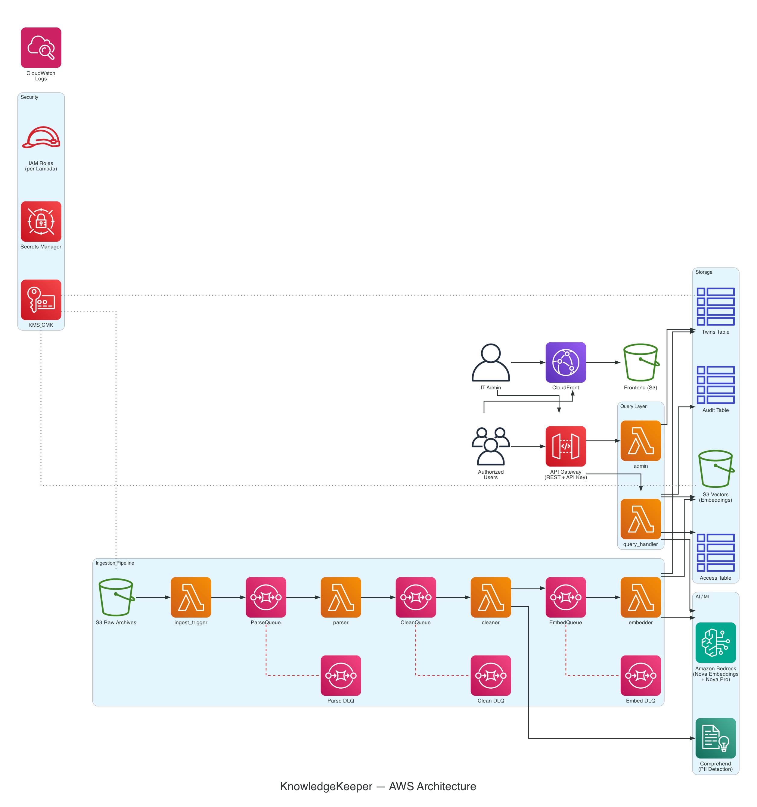

# KnowledgeKeeper

An open-source, self-hosted platform that transforms departing employees' email archives into persistent, queryable AI-powered knowledge bases — **digital twins**. Triggered by IT Admins during standard employee offboarding, it preserves institutional knowledge that would otherwise be lost.

## How It Works

1. IT Admin triggers offboarding for a departing employee
2. System ingests their email archive (Google Workspace, Microsoft 365, or direct .mbox upload)
3. Emails are parsed into threads, cleaned, PII-redacted, chunked, and embedded
4. A digital twin is created — a queryable knowledge profile
5. Authorized colleagues ask natural language questions and get cited, grounded answers

## Features

### Directory Employee Lookup

Search for employees by email or ID directly from the offboarding form. KnowledgeKeeper queries your corporate directory (Microsoft Entra ID, Google Workspace, or LDAP) and auto-fills the form fields. To use it, type an email or employee ID into the lookup field at the top of the offboarding form and click "Lookup".

### Directory Provider Settings

Configure your directory provider from the Admin Dashboard — no CDK redeployments or AWS console access needed. Navigate to `/settings` (or click "Settings" in the dashboard header) to:

1. Select your provider (Microsoft Entra ID, Google Workspace, or LDAP)
2. Enter credentials (tenant ID / client ID / client secret for Microsoft, service account JSON key for Google, or server URL / bind DN / password for LDAP)
3. Click "Test Connection" to verify credentials work before saving
4. Click "Save" to persist — credentials are stored in AWS Secrets Manager, never in the browser

The directory lookup Lambda picks up the new config at runtime from DynamoDB, so changes take effect immediately.

### Microsoft 365 Email Ingestion

Ingest emails from Microsoft 365 mailboxes in addition to Google Workspace. When offboarding an employee, select "Microsoft 365" as the provider. The system authenticates via the Microsoft Graph API using app credentials stored in Secrets Manager (`kk/{env}/m365-credentials`), fetches all mail folders (excluding Deleted Items and Junk Email), converts messages to .mbox format, and uploads them to S3. The downstream pipeline handles the rest — no changes needed.

## Architecture



Fully serverless on AWS. Two independent layers sharing a storage tier:

- **Ingestion Pipeline** — S3 events → SQS → Lambda chain (parser → cleaner → embedder)
- **Query Layer** — API Gateway → Lambda (embed query → S3 Vectors search → Nova Pro RAG)
- **Storage** — S3 (raw archives), S3 Vectors (embeddings), DynamoDB (metadata, access, audit)

All AI calls go through Amazon Bedrock (Nova Multimodal Embeddings + Nova Pro). No external API calls. Data never leaves your AWS account.

## Tech Stack

| Layer | Technology |
|-------|-----------|
| Compute | AWS Lambda (Python 3.12) |
| Embeddings | Amazon Nova Multimodal Embeddings (1024-dim, cosine) |
| Generation | Amazon Nova Pro via Bedrock Converse API |
| Vector Store | Amazon S3 Vectors |
| Metadata | Amazon DynamoDB |
| PII Detection | Amazon Comprehend |
| API | Amazon API Gateway (REST, API key auth) |
| IaC | AWS CDK (Python) |
| Frontend | React 18 + TypeScript + Vite + TailwindCSS |

## Project Structure

```
knowledgekeeper/
├── infrastructure/         # AWS CDK stacks (Python)
│   ├── app.py              # CDK app entry point
│   ├── cdk.json            # Environment config
│   └── stacks/             # KKStorageStack, KKIngestionStack, KKQueryStack
├── lambdas/                # Lambda function code
│   ├── shared/             # Shared layer (models, bedrock, dynamo, s3vectors)
│   ├── ingestion/          # trigger, email_fetcher, parser, cleaner, embedder
│   └── query/              # query_handler, admin
├── frontend/               # React 18 + TypeScript
├── tests/                  # Integration tests and fixtures
└── docs/                   # Deployment guide, API reference
```

## Prerequisites

- Python 3.12+
- Node.js 18+ (for CDK CLI and frontend)
- AWS CLI configured with credentials
- AWS CDK CLI v2.1114.1+ (`npm install -g aws-cdk@latest`)
- Docker (for Lambda layer bundling during CDK synth)

## Quick Start

```bash
# Clone and set up
git clone https://github.com/your-org/knowledgekeeper.git
cd knowledgekeeper

# Bootstrap CDK (first time per account/region)
cdk bootstrap aws://<ACCOUNT_ID>/eu-central-1

# Deploy everything (defaults to eu-central-1)
./deploy.sh

# Deploy to a specific region or environment
./deploy.sh --region us-east-1 --env prod

# Deploy backend only (skip frontend build)
./deploy.sh --skip-fe
```

The deploy script handles Python venv setup, CDK synth, stack deployment, frontend build with correct env vars, and S3/CloudFront deployment.

### Manual Frontend Deployment

If you need to redeploy just the frontend after changes:

```bash
cd frontend
npm ci
npm run build
aws s3 sync dist/ s3://kk-<ACCOUNT_ID>-<ENV>-frontend/ --delete --region eu-central-1
aws cloudfront create-invalidation --distribution-id <DIST_ID> --paths "/*"
```

### Local Development

```bash
# Frontend dev server (uses .env.local for local API proxy)
cd frontend
npm install
npm run dev

# Run Lambda unit tests
pip install pytest moto pydantic boto3
pytest lambdas/ -v
```

## Deployment Notes

- Default region is `eu-central-1`. Override with `./deploy.sh --region <region>`.
- Verify Bedrock model availability in your target region before deploying (Nova Embeddings + Nova Pro).
- CDK bootstrap is required once per account/region: `cdk bootstrap aws://<ACCOUNT_ID>/<REGION>`.
- The frontend uses `.env.production` for production builds and `.env.local` for local dev. The deploy script writes `.env.production` automatically.
- CloudFront is a global service — invalidation commands don't need a `--region` flag.

For the full walkthrough see [docs/deployment.md](docs/deployment.md).

## Security

- All data encrypted at rest (KMS CMK) and in transit (TLS 1.2+)
- One IAM role per Lambda function (least privilege)
- PII detection and redaction before any content reaches the vector store
- API key authentication on all endpoints
- Audit trail for every query and admin action
- No public S3 buckets, no hardcoded credentials

## Roadmap

| Status | Feature | Description |
|--------|---------|-------------|
| ✅ Done | Core Platform (MVP) | Email ingestion pipeline, RAG query engine, admin dashboard, access control, twin lifecycle management |
| ✅ Done | Directory Employee Lookup | Auto-fill offboarding form by looking up employees from Microsoft Entra ID, Google Workspace, or LDAP directories |
| ✅ Done | Directory Provider Setup | Self-service UI for IT admins to configure directory provider credentials (including LDAP) without CDK redeployments |
| ✅ Done | Microsoft 365 Email Integration | Ingest departing employees' email archives from M365 mailboxes via Microsoft Graph API |
| 📋 Planned | SharePoint Document Ingestion | Capture OneDrive/SharePoint documents alongside emails, with text extraction, deduplication, and PII detection |
| 📋 Planned | Google Drive Document Ingestion | Capture Google Drive documents (including native Docs/Sheets/Slides export) alongside emails |

## License

MIT
